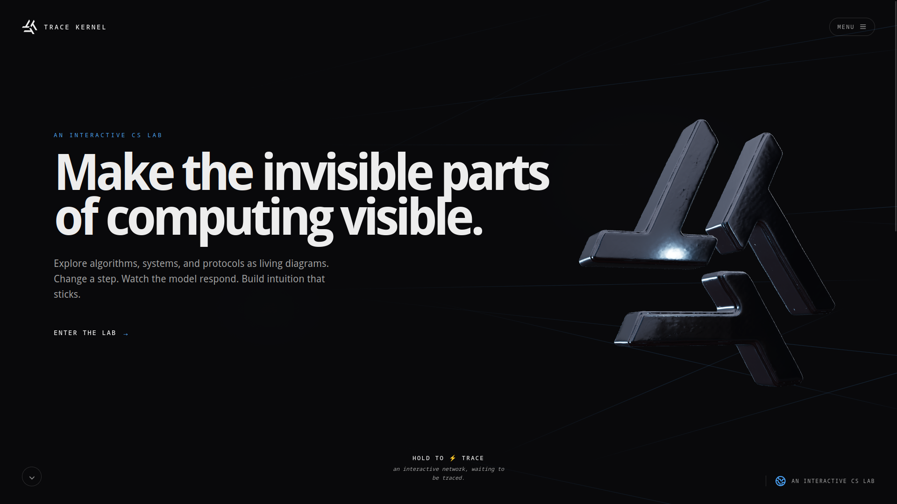
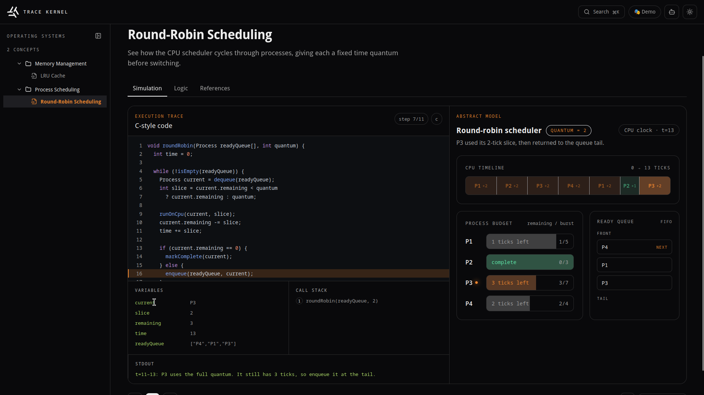
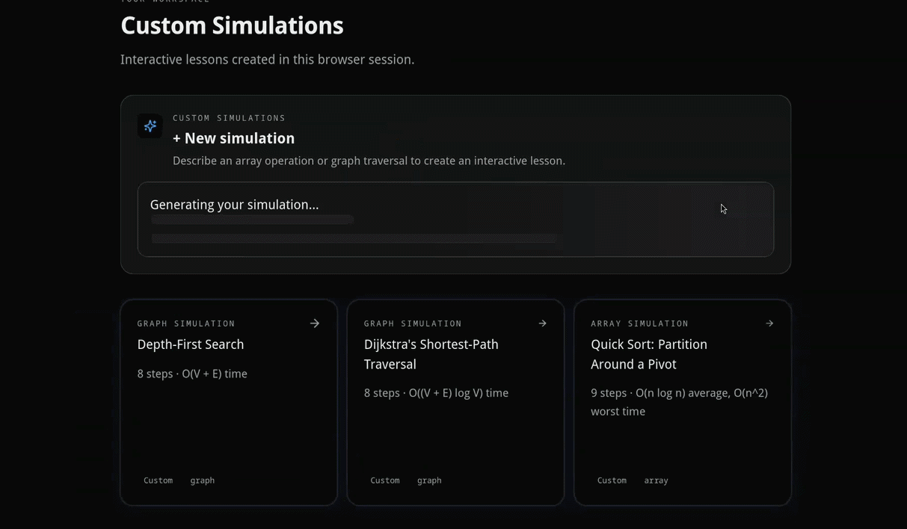
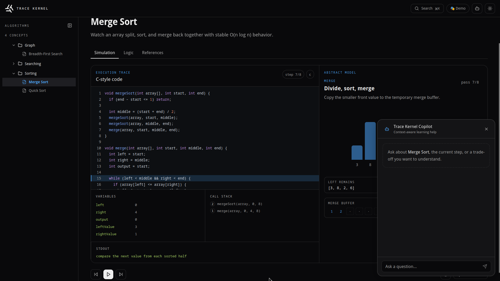
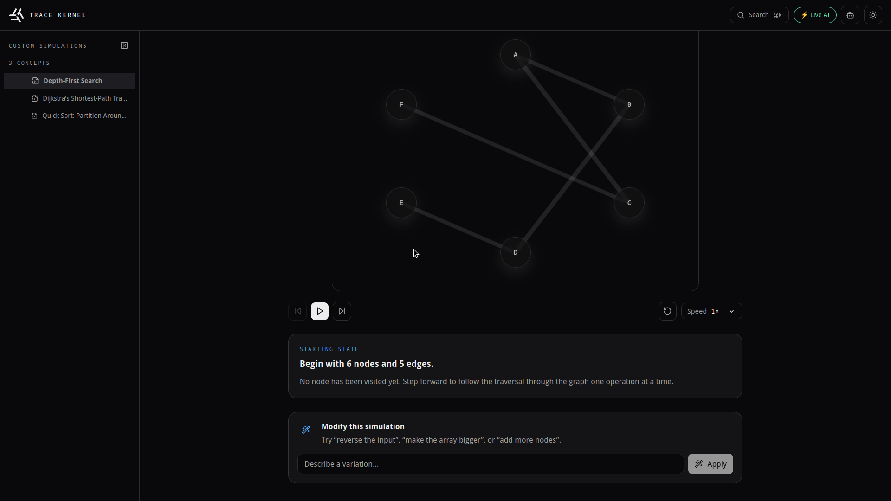

# Trace Kernel

> An AI-powered learning platform that turns computer science concepts into interactive, step-by-step visual simulations — with an agentic Concept Copilot that can explain, navigate, and modify simulations in real time.



---

## What It Does

Trace Kernel transforms how students learn algorithms and data structures. Instead of reading static textbook diagrams, users can:

- **Explore curated concepts** — sorting algorithms, graph traversals, shortest paths, and scheduling — through animated, step-by-step array and graph visualizations.
- **Generate any concept on demand** — type a prompt like "red-black tree insertion" or "topological sort" and the AI produces a complete interactive simulation with pseudocode, complexity analysis, and common pitfalls.
- **Ask the Concept Copilot** — a context-aware AI assistant grounded in the current simulation state. It can explain the current step, compare trade-offs, and even navigate the simulation programmatically using tool calls.
- **Modify simulations in-place** — say "reverse the input" or "add 3 more nodes" and the AI rewrites the simulation while preserving chat history.

---

## Features

### Curated Concept Library
File-driven content system with metadata, simulation specs, logic explanations, and references. Organized into sections: Algorithms, Operating Systems, Networking, Systems, Languages.



### AI-Powered Simulation Generation
Type any CS concept and get a complete interactive simulation with pseudocode, complexity analysis, and common pitfalls. Works with any OpenAI-compatible LLM (Groq, NVIDIA NIM, Ollama, OpenRouter).



### Agentic Concept Copilot
Context-aware chat assistant with tool-calling capabilities:

- **`setSimulationStep`** — navigates the visualizer to any step when the user asks "show me step 3"
- **`modifySimulation`** — rewrites the simulation in-place when the user asks "reverse the input" or "add more nodes"



### In-Place Variation Generator
Modify generated simulations without losing context. Available through both the dedicated Variation Input UI and the Copilot's tool-calling interface.



### Command Palette
Cmd+K / Ctrl+K fuzzy search across all concepts, tags, and topics.

### Theming & Accessibility
Dark/light mode toggle, `prefers-reduced-motion` support, semantic color tokens, and ARIA-labeled interactive elements.

---

## Tech Stack

| Layer | Technology |
|---|---|
| **Frontend** | React 18, TypeScript, Tailwind CSS, Framer Motion |
| **3D Visualizations** | React Three Fiber, Three.js |
| **AI SDK** | Vercel AI SDK (`ai`, `@ai-sdk/react`, `@ai-sdk/openai-compatible`) |
| **Validation** | Zod 4 (discriminated unions for simulation specs) |
| **Navigation** | React Router v6, cmdk (command palette) |
| **Content** | MDX for logic explanations |
| **Backend** | Vercel Serverless Functions (Node.js) |
| **Build** | Vite 6, manual chunk splitting for Three.js |

---

## Architecture

```
┌─────────────────────────────────────────────────┐
│  Vite SPA (React + TypeScript + Tailwind)       │
│  ┌───────────┐ ┌───────────┐ ┌───────────────┐  │
│  │ Workspace │ │ ChatPanel │ │ GenerateInput │  │
│  │           │ │ (Copilot) │ │ + Variation   │  │
│  └─────┬─────┘ └─────┬─────┘ └──────┬────────┘  │
│        │              │              │           │
│  ┌─────▼──────────────▼──────────────▼────────┐  │
│  │  apiClient.ts  (BYO-key headers from       │  │
│  │                 localStorage settings)      │  │
│  └─────────────────────┬──────────────────────┘  │
└────────────────────────┼─────────────────────────┘
                         │  HTTP
┌────────────────────────▼─────────────────────────┐
│  Vercel Serverless Functions                      │
│  ┌──────────────┐ ┌────────┐ ┌────────────────┐  │
│  │ generate-    │ │ chat   │ │ modify-        │  │
│  │ simulation   │ │ (stream│ │ simulation     │  │
│  │ (generateText│ │  +tools│ │ (generateText  │  │
│  │  +normalize) │ │  )     │ │  +normalize)   │  │
│  └──────┬───────┘ └───┬────┘ └───────┬────────┘  │
│         └─────────────┼──────────────┘           │
│                       │                          │
│  ┌────────────────────▼──────────────────────┐   │
│  │  aiProvider.ts  (OpenAI-compatible factory)│   │
│  │  headers → env vars → defaults             │   │
│  └────────────────────┬──────────────────────┘   │
└───────────────────────┼──────────────────────────┘
                        │
        ┌───────────────▼───────────────┐
        │  Any OpenAI-compatible API    │
        │  (NVIDIA NIM / Groq / Ollama  │
        │   / OpenRouter / etc.)        │
        └───────────────────────────────┘
```

### Key Architecture Decisions

- **Zod-validated simulation schema** — `SimulationSpecSchema` with discriminated unions (`array` vs `graph`) enforces type-safe simulation data from AI responses, fixtures, and session storage.
- **OpenAI-compatible provider abstraction** — Provider factory routes to any standard endpoint (NVIDIA NIM, Groq, Ollama, OpenRouter) via base URL + model + API key, configurable per-request through browser headers.
- **Agentic tool calling** — Copilot backend defines `setSimulationStep` and `modifySimulation` tools using the AI SDK's `tool()` API with Zod input schemas.
- **LLM output normalization** — `normalizeRawSpec()` patches common JSON deviations from open-source models before Zod validation.
- **Fixture-based demo mode** — 8 keyword-matched fixture files enable a fully functional demo without any API key.
- **Session-scoped persistence** — Generated concepts stored in `sessionStorage`, restored on page reload. Three demo fixtures pre-seed on first visit.
- **BYO-key settings modal** — Browser-side settings panel stores provider credentials in `localStorage`, sent as headers to keep secrets off the server.

---

## Project Structure

```
src/
├── app/                    # App root, router, providers
│   ├── App.tsx
│   ├── providers.tsx
│   └── router.tsx
├── components/
│   ├── simulation/         # Visualizer engines
│   │   ├── ArrayVisualizer.tsx
│   │   ├── GraphVisualizer.tsx
│   │   ├── DynamicSimulation.tsx
│   │   └── SimulationStepExplanation.tsx
│   └── ui/                 # Shared UI primitives
│       ├── SimulationControls.tsx
│       └── SimulationErrorBoundary.tsx
├── content/                # File-driven concept plugins
│   ├── algorithms/
│   │   ├── sorting/        # merge-sort, quick-sort
│   │   ├── searching/      # binary-search
│   │   └── graph/          # breadth-first-search
│   ├── os/                 # process-scheduling, memory-management
│   ├── networking/         # tcp-handshake, dns-resolution
│   ├── systems/            # memory, pointers
│   └── languages/          # c, cpp, python, java, go
├── features/
│   ├── chat/               # AI Copilot
│   ├── code-trace/         # Code stepping display
│   ├── generate/           # AI generation + variation
│   ├── references/         # Reference cards
│   ├── search/             # Command palette
│   ├── settings/           # BYO-key modal
│   ├── sidebar/            # Library tree
│   └── theme/              # Dark/light mode
├── lib/                    # Registry, types, utilities
│   ├── contentLoader.ts    # Vite import.meta.glob registry
│   ├── simulationSpec.ts   # Zod schema
│   ├── apiClient.ts
│   ├── aiProvider.ts
│   └── types.ts
├── pages/                  # Landing, Workspace, HeroScene
├── styles/                 # Tokens and global styles
└── main.tsx                # App entry point

api/                        # Vercel Serverless Functions
├── chat.ts                 # AI Copilot streaming endpoint
├── generate-simulation.ts  # AI simulation generation
└── modify-simulation.ts    # AI simulation modification
```

---

## Local Development

```bash
# Install dependencies
npm install

# Copy environment template
cp .env.example .env

# Set your AI provider key (Groq recommended for speed)
# AI_BASE_URL=https://api.groq.com/openai/v1
# AI_MODEL=llama-3.3-70b-versatile
# AI_API_KEY=gsk_your_key_here
# USE_FIXTURES=false

# Start the Vercel-compatible dev server
npx vercel dev
```

### Live AI Mode

Set `USE_FIXTURES=false` and provide an `AI_API_KEY`. Any OpenAI-compatible provider works:

| Provider | Base URL | Recommended Model |
|---|---|---|
| **Groq** (fastest, free tier) | `https://api.groq.com/openai/v1` | `llama-3.3-70b-versatile` |
| **NVIDIA NIM** (default) | `https://integrate.api.nvidia.com/v1` | `meta/llama-3.3-70b-instruct` |
| **Ollama** (local) | `http://localhost:11434/v1` | `llama3.3` |
| **OpenRouter** | `https://openrouter.ai/api/v1` | Any supported model |

---

## API Endpoints

| Endpoint | Method | Description |
|---|---|---|
| `/api/generate-simulation` | POST | Generate a new simulation from a natural language prompt |
| `/api/chat` | POST | Streaming chat with the Concept Copilot (includes tool calling) |
| `/api/modify-simulation` | POST | Modify an existing simulation in-place |

---

## Content Architecture

Each concept in the library follows a plugin contract. Concepts live in `src/content/<section>/<concept>/`:

```
concept/
├── meta.json           # { id, title, section, difficulty, tags, ... }
├── Simulation.tsx      # Standalone React component (shared controls)
├── logic.mdx           # Explanation with pseudocode, complexity, pitfalls
└── references.json     # Curated external resources
```

The content loader (`src/lib/contentLoader.ts`) uses Vite's `import.meta.glob` to eagerly load metadata and lazily load simulations. Adding a new concept requires zero changes to routing, sidebar, or app shell code.

---

## Environment Variables

| Variable | Required | Default | Description |
|---|---|---|---|
| `AI_API_KEY` | Yes (live mode) | — | API key for the AI provider |
| `AI_BASE_URL` | No | `https://integrate.api.nvidia.com/v1` | Base URL for the OpenAI-compatible provider |
| `AI_MODEL` | No | `meta/llama-3.3-70b-instruct` | Model identifier |
| `USE_FIXTURES` | No | `true` | Set to `false` to enable live AI mode |

---

## Production Build

```bash
npm run build
```

Output is written to the `dist/` directory, ready for deployment to Vercel.

---

## Team

Built by a team of two contributors as part of the OpenAI Build Week hackathon.

## License

MIT
